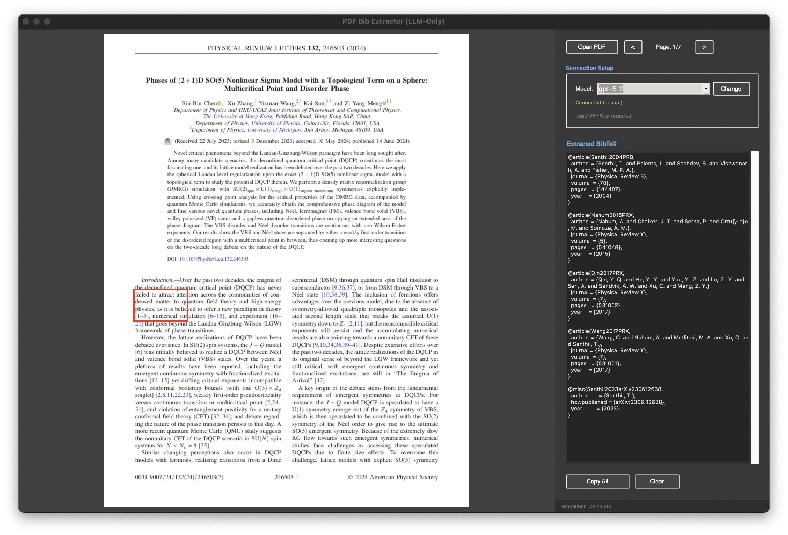

# AI BibTeX Extractor

An intelligent, LLM-driven GUI tool for extracting BibTeX citations from PDFs.


*The interface showing a PDF with selected text (left) and the extracted BibTeX result (right).*

## Logic
This tool relies entirely on a generic LLM (Gemini or OpenAI) to "see" your document and understand your requests, bypassing brittle regex parsers.

**Core Workflow:**
1.  **Context**: The tool loads the **Full Document Text** into the LLM's context window, ensuring it can resolve references scattered anywhere (Intro, Main Text, Appendix).
2.  **Selection**: You select *any* citation text in the PDF viewer (e.g., `[1]`, `(Smith 2020)`, `see Refs [1-5]`).
3.  **Resolution**: The app sends your selection + the document context to the LLM.
4.  **Extraction**: The LLM locates the corresponding reference(s) and generates standardized BibTeX.

## Features
*   **LLM-Only Backend**: No regex. Handles superscript, square brackets, author-year, and footnotes seamlessly.
*   **Smart Selection**:
    *   **Ranges**: Select `[1-3]` -> Extracts Refs 1, 2, and 3.
    *   **Disjoint**: Select sentence like `...[1] and later [5]...` -> Extracts both.
    *   **Lists**: Select a block of bibliography -> Extracts all entries.
*   **Model Switching**:
    *   Switch between **OpenAI** (`gpt-4o`, `gpt-5.2`) and **Gemini** (`1.5-flash`, `1.5-pro`) on the fly via the GUI dropdown.
*   **Persistence**: Your API Key is saved securely to `~/.bib_extractor_config.json`.

## Requirements
*   **Python 3.10+**
*   **API Key**: A valid API Key from Google (Gemini) or OpenAI.
    *   **Google**: `gemini-1.5-flash` (Free Tier usage available).
    *   **OpenAI**: `gpt-4o`, `gpt-5.2` (Requires access).

## Installation
```bash
pip install pymupdf Pillow google-generativeai openai
```

## Usage
1.  **Run the App**:
    ```bash
    python bib_app.py
    ```
2.  **Authenticate**:
    *   Enter your API Key and click **Verify**.
    *   Once connected, use the **Model Dropdown** to choose your preferred model (e.g., switch to `gpt-5.2` for complex reasoning).
3.  **Open PDF**:
    *   Click **Open PDF**. The tool silently pre-loads the full text context.
4.  **Extract**:
    *   **Draw a red box** around any citation handle.
    *   The extracted BibTeX will appear in the right-hand panel.

## Troubleshooting
*   **"Unresolved Reference"**: If the LLM returns an error note, ensure the bibliography text is searchable (not an image).
*   **Segmentation Fault**: If the app crashes on selection (rare), it may be a UI thread conflict. Simply restart the app; previous keys are saved.
